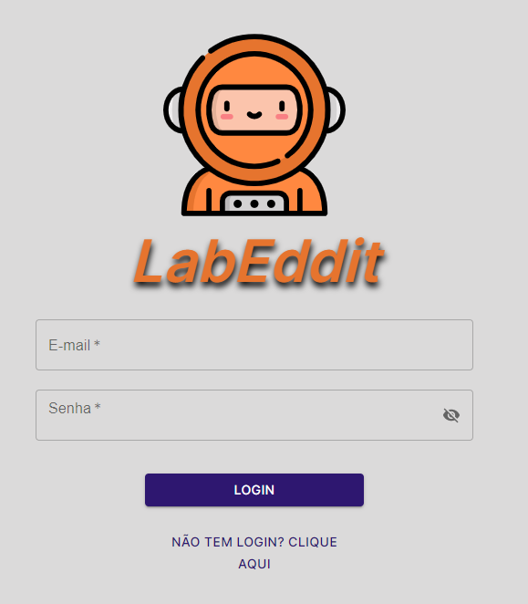
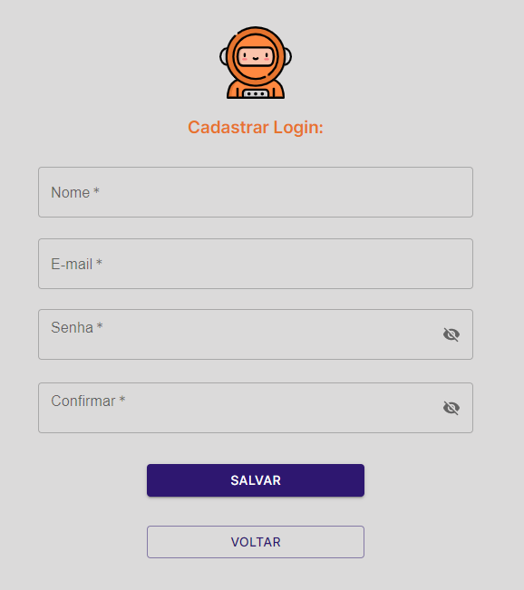
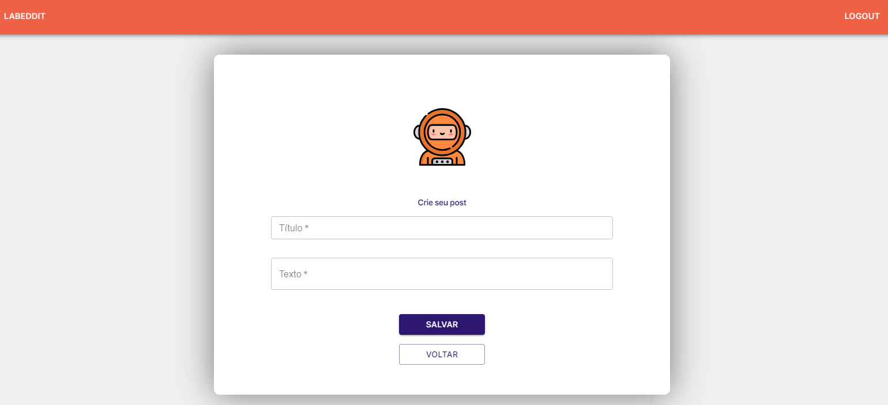
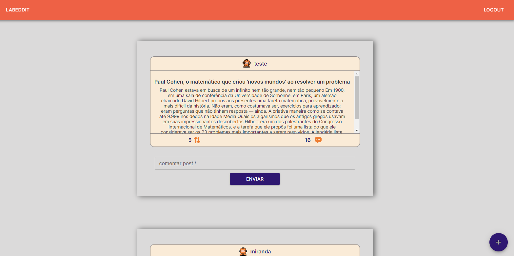
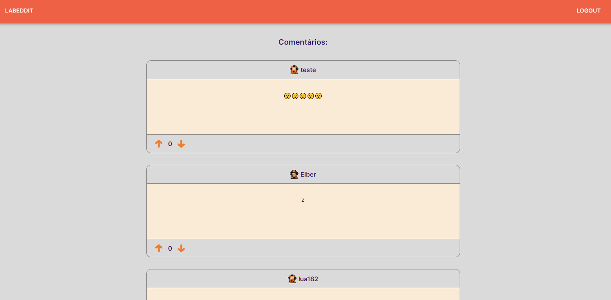
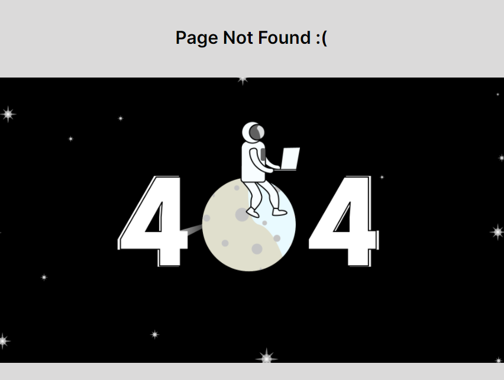

#  _Projeto LabEddit_  

Este projeto foi desenvolvido no curso da `Labenu` é um projeto desenvolvido em React e tem as funcionalidades básicas baseado no social bookmarks Reddit.

`Link do surge:`

***
 

**Para utilizar este projeto você precisa dos primeiros passos abaixo:**

- Clonar este repositório
- Executar o comando npm install no terminal

**Para rodar este projeto:**
- npm run start (visualização no browser)
- através do console no browser será possível ver os retornos e erros da aplicação.

*** 
 

**Funcionalidades existentes neste projeto são:** 
 

- Fazer login/logout
- Fazer cadastro de na aplicação
- Quando o usuário está logado:
  * Pode ver todos os posts.
  * Postar, comentar e votar em outros posts.
  

***
 

### Bibliotecas, Frameworks e recursos utilizados neste projeto:

   
   
   
 
   
   
   

 

### Imagens do projeto:

   
Página de Login

  
   
 
 
   
Página de Cadastro

   
 
 
   
Página de Criar Posts

   
 
 
   
Página de Posts

   
 
 
   
Página de Comentários

   
 
 
   
Página de Erro

   

